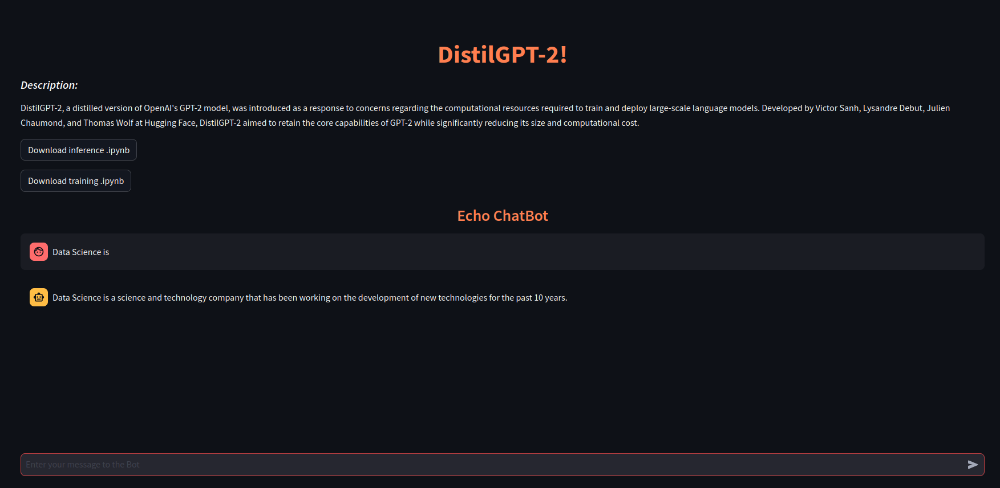

# LSML2 Final Project 

## 1. Introduction

This project provides code for fine-tuning DistilGPT2 and developing a frontend and backend to deploy the fine-tuned model via a web-based UI. The task is text generation (language modeling).

## 2. Architecture

We’ll set up two Docker containers: one for the front-end application, which provides a user-friendly interface via Streamlit, and another for the back-end application, which employs a pre-trained neural network to make predictions through an API. Both will be configured to communicate within a single network using Docker-Compose.

## 3. Run

**Step 1**: Create a new directory on your local machine and execute the `git clone` command:

    git clone git@github.com:alshlyapin/lsms2.git

**Step 2**: Go into `lsml2/backend` directory (instruction for Linux):

    cd lsml2/backend_engine

**Step 3**: Downdload [weights from Google Drive](https://drive.google.com/file/d/1CtYjI_CxVNUYi-ha-CUBw5SaTFMJLxY_/view?usp=sharing) into this folder (lsml2/backend_engine)

**Step 4**: Go back to `lsml2` directory (instruction for Linux):

    cd ..

**Step 3**: The following command consolidates the outputs from each container:

    docker-compose up

**Step 4**: To access the backend’s health status (API), open the following URL in your browser:

    http://localhost:5000/

**Step 5**: To interact with the User Interface (UI), please open the following URL in your browser:

    http://localhost:8501/ 

**Step 6**: Try some promps, e.g.:

    Data Science is

## 4. Model

The model is a fine-tuned from [DistilGPT2](https://huggingface.co/distilbert/distilgpt2), trained using an NVIDIA GeForce RTX 3090.

Short description from [the model card on Hugging Face](https://medium.com/huggingface/distilbert-8cf3380435b5):

> DistilGPT2 (short for Distilled-GPT2) is an English-language model pre-trained with the supervision of the smallest version of Generative Pre-trained Transformer 2 (GPT-2). Like GPT-2, DistilGPT2 can be used to generate text. Users of this model card should also consider information about the design, training, and limitations of GPT-2.

## 5. Data

The model was fine-tuned on [WikiText-103-raw-v1](https://huggingface.co/datasets/wikitext). The WikiText language modeling dataset comprises a compilation of more than 100 million tokens, derived from Wikipedia's selection of validated Good and Featured articles.

## 6. Notebooks

- The notebook for training is [here](https://github.com/alshlyapin/lsms2/blob/main/chat_bot/distilgpt2_train.zip).
- The notebook for inference is [here](https://github.com/alshlyapin/lsms2/blob/main/chat_bot/distilgpt2_inference.zip).

You can also download them through UI.

## 7. Frontend

The User Interface is realized on the frontend using [Streamlit](https://streamlit.io/). Text from the UI is transmitted to the backend as a JSON file through HTTP requests.

## 8. Backend

The backend is designed using the Flask framework. It accepts text input from the UI, generates a response using the fine-tuned DistilGPT model, and then sends this response back to the UI.

    # for Linux
    curl -X POST http://localhost:5000/predict -d '{"text":"Data Science is"}'
